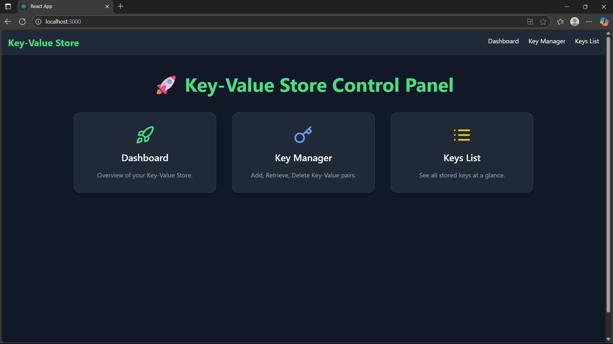
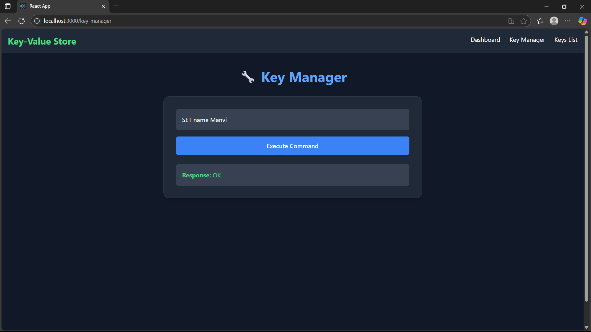
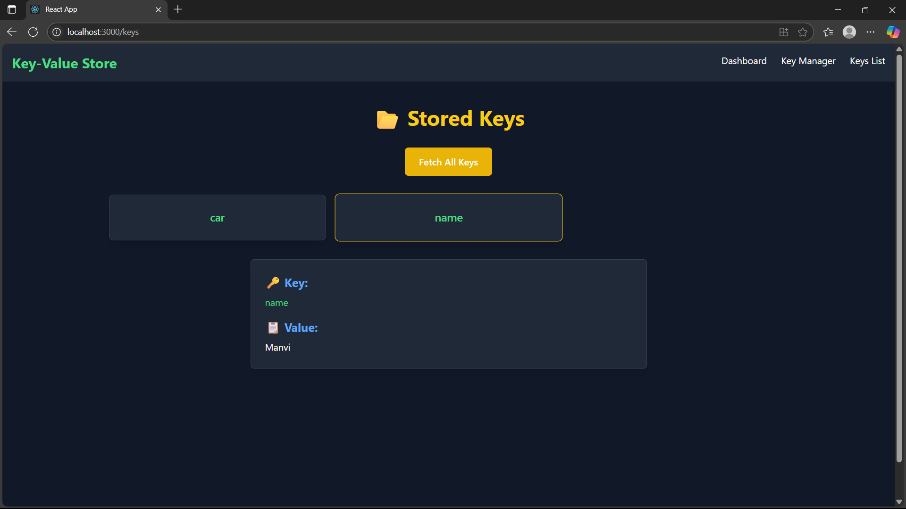

# 🚀 Distributed In-Memory Key-Value Store (React + Node/Java Backend)

A fast, lightweight, distributed **In-Memory Key-Value Store** inspired by Redis, featuring:
- ⚡ React-based Modern Web UI (Dark Mode)
- 📝 Command-based Key-Value Operations (SET, GET, DELETE, KEYS)
- 📡 Backend Server (Node.js + optional Java TCP Server)
- 📦 Minimal dependencies & easy deployment

## 💡 Tech Stack:

| Layer       | Technology              | Description                              |
|-------------|-------------------------|------------------------------------------|
| 🎨 Frontend | React                   | UI library for building web interface    |
|             | Axios                   | HTTP client for API requests             |
|             | Tailwind CSS (Dark Mode)| Utility-first CSS for modern styling     |
| 🔧 Backend  | Node.js (Express)       | REST API to connect frontend & Java server|
|             | Java (TCP Socket)       | Core TCP-based Key-Value store server    |
| 📦 Package  | NPM                     | Node Package Manager                     |
| 🌐 Protocol | HTTP / TCP              | Communication protocols

---
## 📸 UI Screenshots:

<p align="center">
  
</p>

<p align="center">
  
</p>

<p align="center">
  
</p>


## 📂 Project Structure:
/backend → Node.js API (Handles HTTP requests to Java TCP Server)
└── server.js → Express-based REST API
/java-tcp-server → Java-based TCP Key-Value Server (Handles core KV logic)
/my-key-value-ui → React Frontend (User Interface + API Integration)

## ✅ Features:
- **Set** key-value pairs: `SET key value`
- **Get** value by key: `GET key`
- **Delete** keys: `DELETE key`
- **Fetch All Keys**: `KEYS`
- Sleek Dark UI with modern look  
- Separate backend & frontend for scalability

---
## 🏁 Quick Start

### 1️⃣ Java TCP Server
```bash
cd java-tcp-server
javac -d bin src/KeyValueStoreServer.java
java -cp bin KeyValueStoreServer

2️⃣ Node.js Backend (API Layer)

cd backend
npm install
node server.js

3️⃣ React Frontend (User Interface)

cd my-key-value-ui
npm install
npm start

💻 Author:
Developed by Manvi Verma
Feel free to ⭐ star this repo if you found it useful!
